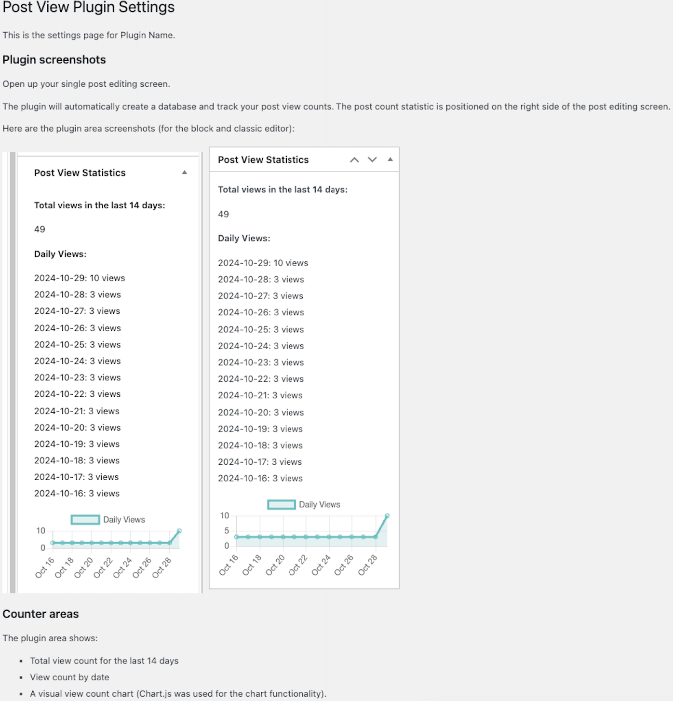

# Post-View-Statistics-Plugin
A plugin that shows the single post view count in the wp-admin backend.

* [Quick start](#quick-start)


## Quick start
 
Use this command list to quickly set up this project locally and start developing more custom components:

```
// Clone this repo
$ git clone https://github.com/DomagojVlaho/Post-View-Statistics-Plugin.git

# Access
$ cd Post-View-Statistics-Plugin

# Install dependencies
$ npm install

# Run the project watcher for development
$ npm start
```

After you've done your work, run the plugin build script to build everything for production:
```
$ npm run build
```

After the build process is done, run the plugin zip script to build a plugin zip folder which you can install to any other Wordpress installation:
```
$ npm run zip
```

## Plugin settings

Once you've installed and activated the plugin to WordPress, navigate to Settings -> Post View Plugin to get more info on the plugin features:

